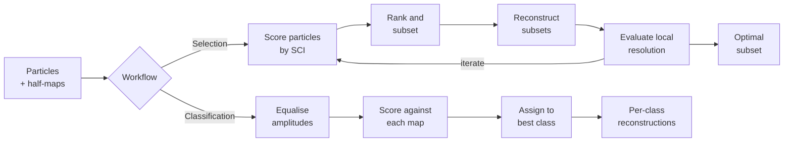

<p align="center">
  
</p>

<h1 align="center">JANAS</h1>
<p align="center"><strong>Joint ANAlysis of Stacks for CryoEM</strong></p>
<p align="center">Per-particle scoring and classification for single-particle cryo-EM</p>

<p align="center">
  <a href="https://pypi.org/project/janas/"></a>
  <a href="https://pypi.org/project/janas/"></a>
  <a href="https://github.com/mauromaiorca/janas/blob/main/LICENSE"></a>
</p>

<p align="center">
  <a href="#installation">Installation</a> &bull;
  <a href="#quick-start">Quick start</a> &bull;
  <a href="tutorial/README.md">Tutorial</a> &bull;
  <a href="tutorial/INSTALL_FROM_SOURCE.md">Build from source</a>
</p>

---

JANAS uses the Structural Cross-correlation Index (SCI) to rank particles by their contribution to local map quality.
It supports two workflows:

- **Iterative particle selection** — score, rank, and select the subset that maximises local resolution.
- **3D class reassignment** — assign particles to pre-computed conformations based on per-map SCI scores.



## Installation

Requires Python 3.8+, a C++ compiler, and CMake 3.10+.

```bash
pip install janas
```

We recommend installing in an isolated environment:

```bash
python3 -m venv ~/.janas_env
source ~/.janas_env/bin/activate
pip install janas
```

Verify:

```bash
janas --version
janas_app_starProcess --h
```

See the [Installation Guide](tutorial/INSTALL.md) for conda, pipx, and troubleshooting.
To build from source, see [Install from source](tutorial/INSTALL_FROM_SOURCE.md).

## Quick start

### Iterative particle selection

```bash
janas_session_manager new_select_session \
    --name my_selection \
    --particles particles.star \
    --map halfA.mrc \
    --map2 halfB.mrc \
    --mask mask.mrc \
    --mpi 40

./my_selection/my_selection_run.sh
```

The output star file is at `my_selection/reference_subset.star`.

### 3D class reassignment

```bash
janas_session_manager classification_session \
    --name reclassify \
    --particles particles.star \
    --maps class1.mrc class2.mrc class3.mrc \
    --mask mask.mrc \
    --mpi 40

./reclassify/reclassify_run.sh
```

Per-class star files and reconstructions are in `reclassify/final_classes/`.

## Commands

| Command | Purpose |
|---------|---------|
| `janas` | Particle scoring, selection, Euler histograms |
| `janas_utils` | Masks, crops, FSC, local resolution, half-map randomisation, cryoSPARC import |
| `janas_session_manager` | Create selection and classification sessions |
| `janas_reconstructor` | 3D reconstruction from scored particles |
| `janas_optimizer` | Overview analysis and optimisation plots |
| `janas_app_starProcess` | STAR file inspection and manipulation (C++) |
| `janas_app_meanMinMax` | Local resolution statistics from masked maps (C++) |

## External dependencies

Some features rely on third-party programs that must be on your `PATH`:

- [RELION](https://relion.eu/) — local-resolution estimation, 3D reconstruction (when not using `--noExternalPrograms`)
- [IMOD](https://bio3d.colorado.edu/imod/) — volume processing
- [pyem](https://doi.org/10.5281/zenodo.3576630) — legacy cryoSPARC import (not needed for `janas_utils csparc2star-stack`)

## Documentation

- [Installation Guide](tutorial/INSTALL.md)
- [Install from source](tutorial/INSTALL_FROM_SOURCE.md)
- [Tutorial (EMPIAR-10308)](tutorial/README.md)
- [Common operations](tutorial/COMMON_OPERATIONS.md)
- [CryoSPARC integration](tutorial/cs_integration.md)
- [Importing from cryoSPARC](tutorial/import_stack_from_cs.md)
- [Computational requirements](tutorial/computational_requirements.md)

## Citation

If you use JANAS in published work, please cite:

> Maiorca, M. *et al.* (2025). JANAS: Joint Analysis of Stacks for CryoEM. *In preparation.*

## Contact

For questions or issues: mauro.maiorca@cssb-hamburg.de or open an issue on [GitHub](https://github.com/mauromaiorca/janas/issues).

## Licence

[MIT](LICENSE)
