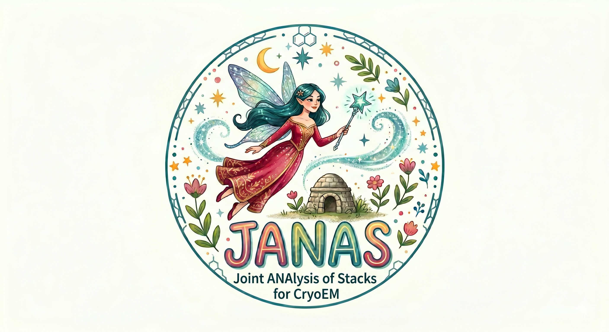

<p align="center">
  
</p>

<h1 align="center">JANAS</h1>
<p align="center"><strong>Joint ANAlysis of Stacks for CryoEM</strong></p>

---

JANAS is a command-line toolkit for iterative particle scoring and classification in single-particle cryo-EM. It uses per-particle Structural Cross-correlation Index (SCI) to rank and select those images that contribute most to local map quality, and to reassign particles to pre-computed 3D conformations to resolve heterogeneity. By focusing each reconstruction on high-quality, class-specific subsets, JANAS refines the final maps and enhances the reliability of downstream model building.

## Quick start

```bash
pip install janas
janas --version
```

For detailed installation instructions (including environment setup, prerequisites, and troubleshooting), see the [Installation Guide](tutorial/INSTALL.md).

## Documentation

- [Installation Guide](tutorial/INSTALL.md) — install from PyPI, manage environments, troubleshooting
- [Install from source](tutorial/INSTALL_FROM_SOURCE.md) — build from repository, C++ apps reference
- [Tutorial](tutorial/README.md) — step-by-step example on EMPIAR-10308
- [Common Operations](tutorial/COMMON_OPERATIONS.md) — quick reference
- [Accessory Programs](tutorial/accessory_programs.md) — third-party dependencies
- [CryoSPARC Integration](tutorial/cs_integration.md) — importing from cryoSPARC
- [Computational Requirements](tutorial/computational_requirements.md) — hardware and performance

## Prepare your dataset

JANAS operates on the standard RELION 3.1 STAR+MRC(S) format: a `.star` file listing the particles and one or more `.mrcs` stacks where each 2D image is a particle.

If you are coming from cryoSPARC, first export your particles as a stack and generate a RELION STAR file ([details here](tutorial/import_stack_from_cs.md)).

Use `janas_app_starProcess` to inspect and manipulate STAR files: randomize or reassign subsets, delete/rename/reorder labels, filter particles, and export to CSV/VEM formats.

## Key commands

### Iterative particle selection

```bash
janas_session_manager new_select_session \
    --name my_selection \
    --particles particles.star \
    --map halfA.mrc \
    --map2 halfB.mrc \
    --mask mask.mrc \
    --angpix 0.84

./my_selection/my_selection_run.sh
```

### 3D class reassignment

```bash
janas_session_manager classification_session \
    --name reclassification \
    --particles particles.star \
    --mask mask.mrc \
    --maps class1.mrc class2.mrc class3.mrc \
    --angpix 0.84 \
    --mpi 85

./reclassification/reclassification_run.sh
```

### Random particle selection (control experiment)

```bash
janas_session_manager random_selection_session \
    --name random_control \
    --particles particles.star \
    --mask mask.mrc \
    --dir output_dir

./output_dir/random_control_run.sh
```

## Contact

For questions or issues, reach out at mauro.maiorca@cssb-hamburg.de or open an issue on [GitHub](https://github.com/mauromaiorca/janas/issues).

## License

MIT
