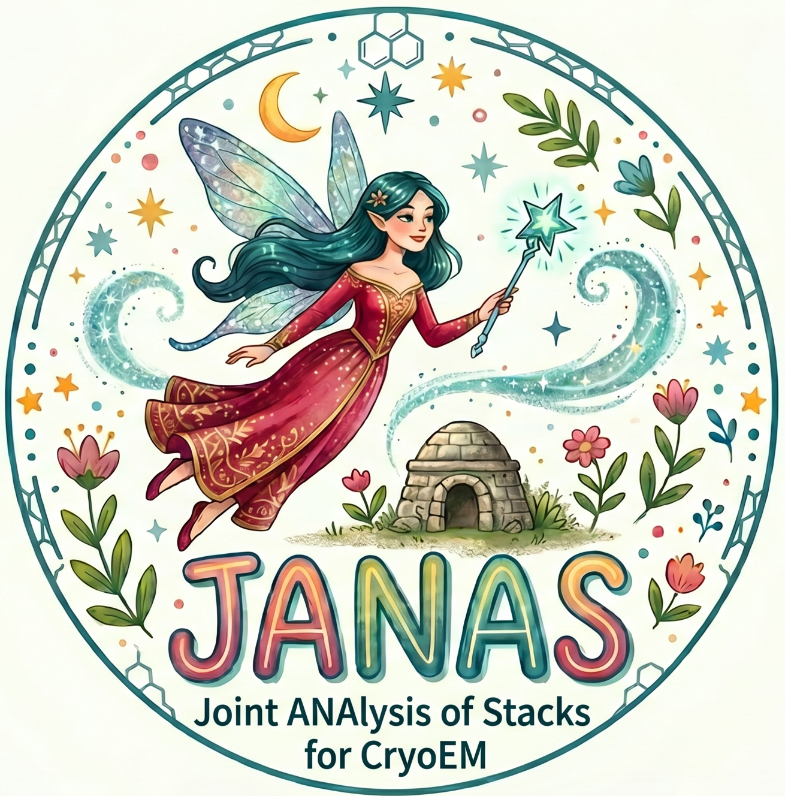

<p align="center">
  
</p>

<h1 align="center">JANAS</h1>
<p align="center"><strong>Joint ANAlysis of Stacks for CryoEM</strong></p>

<p align="center">
  <a href="https://pypi.org/project/janas/"></a>
  <a href="https://pypi.org/project/janas/"></a>
</p>

<p align="center">
  <a href="#installation">Installation</a> &bull;
  <a href="#quick-start">Quick start</a> &bull;
  <a href="docs/index.md">Documentation</a> &bull;
  <a href="https://github.com/mauromaiorca/janas/issues">Issues</a>
</p>

---

JANAS is a command-line toolkit for particle ranking, subset selection and class reassignment in single-particle cryo-EM workflows.

It uses the per-particle Structural Cross-correlation Index (SCI) to rank particles by their contribution to local map quality.

## Core workflows

| Workflow | Purpose |
|----------|---------|
| [Iterative particle selection](docs/ITERATIVE_SELECTION.md)  | Score, rank and select particle subsets that maximise local resolution. |
|  [3D class reassignment](docs/CLASS_REASSIGNMENT.md)  | Assign particles to pre-computed classes using per-map SCI scores. |

## Installation

Requires Python 3.8+, a C++ compiler, and CMake 3.10+.

```bash
pip install janas
```

We recommend installing in an isolated environment:

```bash
python3 -m venv ~/.janas_env
source ~/.janas_env/bin/activate
pip install janas
```

Verify:

```bash
janas --version
```

See the [Installation Guide](docs/installation.md) for conda, pipx, troubleshooting, and building from source.

## Quick start

### Iterative particle selection

```bash
janas_session_manager new_select_session \
    --name my_selection \
    --particles particles.star \
    --map halfA.mrc \
    --map2 halfB.mrc \
    --mask mask.mrc \
    --mpi 40

./my_selection/my_selection_run.sh
```

Output: `my_selection/reference_subset.star`

### 3D class reassignment


```bash
janas_session_manager classification_session \
    --name reclassify \
    --particles particles.star \
    --maps class1.mrc class2.mrc class3.mrc \
    --mask mask.mrc \
    --mpi 40

./reclassify/reclassify_run.sh
```

Output: `reclassify/final_classes/`

## Documentation

- [Documentation index](docs/index.md)
- [Installation](docs/installation.md)
- [Quick start](docs/quick-start.md)
- [Iterative particle selection](docs/workflows/selection.md)
- [3D class reassignment](docs/workflows/classification.md)
- [CryoSPARC integration](docs/workflows/cryosparc.md)
- [CLI command reference](docs/reference/cli.md)
- [STAR file operations](docs/reference/star-operations.md)
- [Computational requirements](docs/reference/computational-requirements.md)
- [Tutorial: EMPIAR-10308](docs/examples/empiar-10308.md)
- [Troubleshooting](docs/troubleshooting.md)


## Contact

For questions or issues: mauro.maiorca@cssb-hamburg.de or open an issue on [GitHub](https://github.com/mauromaiorca/janas/issues).
