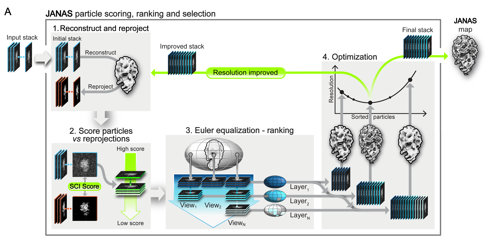

[Repository home](../README.md) · [Installation](installation.md) · [Quick start](quick-start.md) · [CLI reference](reference/cli.md) · [Troubleshooting](troubleshooting.md)

---

# Iterative Selection

<p align="center">
  
</p>
## Introduction


Iterative selection identifies a particle subset that aims to support a more interpretable reconstruction. Starting from an input particle stack, reference map, and mask, JANAS scores particles using the Structural Cross-correlation Index (SCI), ranks them while accounting for angular distribution, and evaluates candidate particle subsets through repeated reconstruction.

Rather than selecting a fixed percentage of particles, JANAS searches for the particle count that gives the most favourable local-resolution behaviour within the masked region. This allows the workflow to retain particles that contribute consistently to the reconstruction while excluding particles that reduce map quality or introduce artefacts.


## Quick start

### Create & Launch the session manager

```bash
janas_session_manager new_select_session \
    --name my_selection \
    --particles particles.star \
    --map halfA.mrc \
    --map2 halfB.mrc \
    --mask mask.mrc \
    --mpi 40

./my_selection/my_selection_run.sh
```
