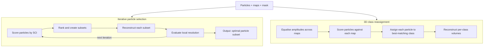

# JANAS

**Joint ANAlysis of Stacks for CryoEM**

JANAS is a command-line toolkit for iterative particle scoring and classification in single-particle cryo-EM. It uses the per-particle Structural Cross-correlation Index (SCI) to rank and select particles that contribute most to local map quality, and to reassign particles to pre-computed 3D conformations.

## What JANAS does

- **Iterative particle selection** — scores particles against reference half-maps, ranks them by SCI, and iteratively determines the subset that maximises mean local resolution within a defined mask.
- **3D class reassignment** — scores particles against multiple amplitude-equalised reference maps, assigns each particle to the map with the highest SCI, and reconstructs per-class volumes.

## Getting started

1. [Install JANAS](installation.md)
2. [Run through the quick start](quick-start.md)
3. [Follow the EMPIAR-10308 tutorial](examples/empiar-10308.md) for a complete worked example

## Input format

JANAS operates on RELION 3.1 STAR+MRC(S) format: a `.star` file listing the particles and one or more `.mrcs` stacks containing the 2D particle images. If you are coming from cryoSPARC, see [CryoSPARC integration](workflows/cryosparc.md).
